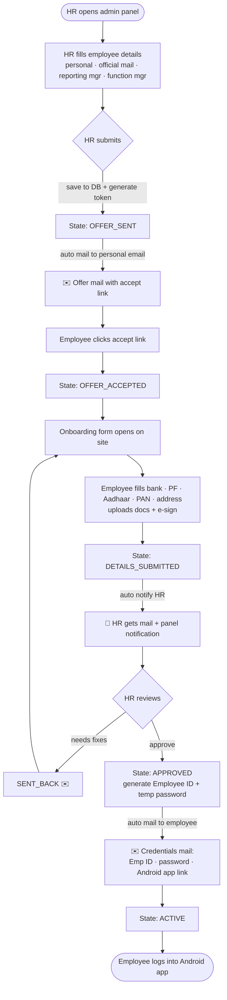
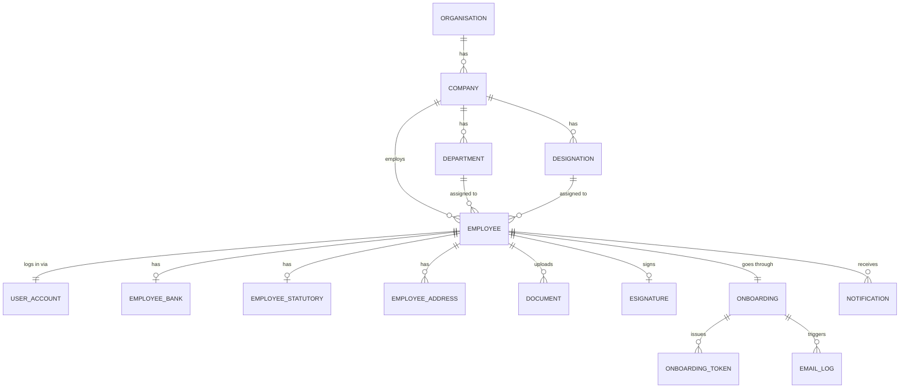
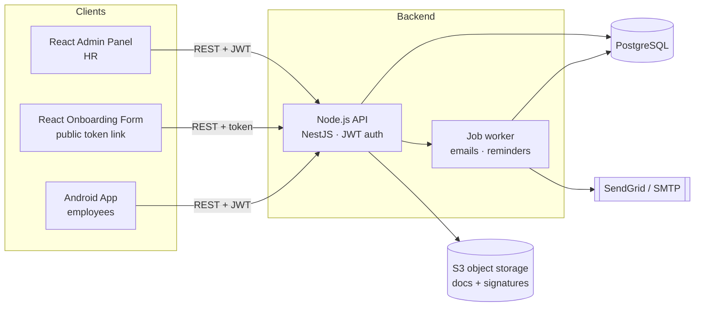

# TRUE HR — HRMS System Plan

**Version:** 1.0  ·  **Date:** 16 June 2026
**Scope of this document:** end-to-end plan for the HRMS, focused on the employee onboarding pipeline.

---

## 1. Overview

TRUE HR is a multi-tenant-ready HRMS. For v1 we run a single organisation (**TRUE HR**) with one static company beneath it. The system has two clients and one backend:

| Component | Who uses it | Tech |
|---|---|---|
| **Admin / HR panel** | HR, admins | React web UI |
| **Onboarding web form** | New employee (pre-hire, public link) | React web (token-gated) |
| **Employee mobile app** | Active employees | Native Android (Kotlin) |
| **Backend API** | All clients | Node.js (NestJS/Express) |
| **Database** | — | PostgreSQL |
| **Email** | Automated mails | SendGrid (transactional) + SMTP fallback |
| **File storage** | Documents, signatures | S3-compatible object storage |

> Note: there is **no admin functionality in the Android app**. Admin/HR work happens only in the web panel. The Android app is employee-facing only and is reachable only after onboarding is approved.

---

## 2. Organisation structure

```
Organisation: TRUE HR
   └── Company: True HR Pvt Ltd   (static, seeded for v1)
          ├── Departments (Engineering, HR, Sales, …)
          ├── Designations (SDE-1, HR Manager, …)
          └── Employees
                 ├── reporting_manager  → Employee
                 └── function_manager   → Employee
```

---

## 3. The onboarding pipeline (core of the system)

The whole flow is modelled as a **state machine** on an onboarding record. Each transition is triggered by an actor (HR or employee) and may fire an automated email and/or in-app notification.

### 3.1 States & transitions

| # | State | Triggered by | What happens | Email / notification |
|---|---|---|---|---|
| 1 | `DRAFT` | HR | HR fills personal details, official mail, reporting manager, function manager, dept, designation, CTC, joining date. | — |
| 2 | `OFFER_SENT` | HR submits | Employee record saved to DB. A signed, single-use, expiring **acceptance link** is generated. | ✉️ **Offer/Welcome mail** → employee **personal email** with accept link |
| 3 | `OFFER_ACCEPTED` | Employee clicks link | Token validated; employee lands on site and accepts the letter. | (optional confirmation mail) |
| 4 | `DETAILS_PENDING` | auto after accept | Onboarding form opens for the employee. | — |
| 5 | `DETAILS_SUBMITTED` | Employee submits + e-signs | Employee fills bank, PF/UAN, Aadhaar, PAN, address, emergency contact, uploads docs, and applies **e-signature**. | 🔔 **HR notified** (mail + in-panel) that a submission needs review |
| 6 | `HR_REVIEW` | HR opens it | HR reviews submitted details/documents. | — |
| 7a | `SENT_BACK` | HR | HR returns the form for corrections (with notes). Goes back to step 4. | ✉️ Correction-request mail → employee |
| 7b | `APPROVED` | HR approves | Employee ID generated, login account created, temp password set. | ✉️ **Credentials mail** → employee: Employee ID + temp password + Android app download link |
| 8 | `ACTIVE` | auto | Employee can now log into the Android app (forced password change on first login). | — |
| — | `EXPIRED` | system | Acceptance link not used before expiry; HR can re-issue. | ✉️ reminder before expiry |

### 3.2 Flow diagram



### 3.3 Secure links (magic links)

Acceptance and form links are **not** guessable:
- A random 32-byte token is generated; only its **hash** is stored in DB.
- The token is single-use and expires (e.g. offer link 7 days, form session shorter).
- Token carries no rights beyond the specific onboarding record + step.
- All onboarding endpoints validate the token server-side before doing anything.

---

## 4. Data model (PostgreSQL)

### 4.1 Entity-relationship diagram



### 4.2 Key tables

**organisations** — `id, name ("TRUE HR"), created_at`

**companies** — `id, organisation_id (FK), name, legal_name, logo_url, address, created_at`

**departments** — `id, company_id (FK), name`

**designations** — `id, company_id (FK), title, grade`

**user_accounts** (auth) — `id, employee_id (FK, nullable until APPROVED), email (official), password_hash, role (HR_ADMIN | EMPLOYEE), status (PENDING | ACTIVE | DISABLED), must_change_password (bool), last_login_at`

**employees** — core profile:
`id, employee_code (generated on approval), company_id, department_id, designation_id,
first_name, last_name, dob, gender, phone, personal_email, official_email,
reporting_manager_id (FK→employees), function_manager_id (FK→employees),
date_of_joining, employment_type, ctc, onboarding_status, created_by (HR), created_at`

**onboarding** — `id, employee_id (FK), state (enum, see §3.1), current_step, submitted_at, reviewed_by, reviewed_at, review_notes`

**onboarding_tokens** — `id, onboarding_id (FK), token_hash, purpose (ACCEPT | FORM), expires_at, used_at`

**employee_bank** — `id, employee_id, account_holder, account_number, ifsc, bank_name, branch`

**employee_statutory** — `id, employee_id, pan, aadhaar (encrypted), uan, pf_number, esi_number`

**employee_addresses** — `id, employee_id, type (CURRENT | PERMANENT), line1, line2, city, state, pincode, country`

**documents** — `id, employee_id, type (PAN | AADHAAR | PHOTO | CERT | …), file_url, uploaded_at, verified (bool)`

**esignatures** — `id, employee_id, onboarding_id, signature_image_url, signed_at, ip_address, user_agent`

**notifications** — `id, recipient_user_id, type, title, body, read (bool), created_at`

**email_log** — `id, to_email, template, status (SENT|FAILED), provider_message_id, sent_at, onboarding_id`

**audit_log** — `id, actor_user_id, action, entity, entity_id, metadata (jsonb), created_at`

> PII fields (Aadhaar, PAN, bank account) are stored **encrypted at rest** (column-level encryption / pgcrypto) and masked in API responses.

---

## 5. System architecture



**Notes**
- The job worker (e.g. BullMQ + Redis, or a simple queue) handles all outbound mail and scheduled reminders so the API stays responsive.
- Documents/signature images go to object storage; only URLs/keys live in Postgres.
- One auth system, two roles (`HR_ADMIN`, `EMPLOYEE`). Onboarding endpoints use short-lived tokens instead of full login.

---

## 6. API surface (representative)

### Auth
- `POST /auth/login` — HR & employees (returns JWT)
- `POST /auth/change-password` — forced on employee first login

### Admin / HR (JWT, role HR_ADMIN)
- `POST /employees` — create employee + start onboarding (fires offer mail)
- `GET /employees` · `GET /employees/:id`
- `POST /employees/:id/resend-offer`
- `GET /onboarding?state=DETAILS_SUBMITTED` — review queue
- `POST /onboarding/:id/approve` — generate emp ID + account + credentials mail
- `POST /onboarding/:id/send-back` — return with notes
- CRUD for departments, designations, managers

### Onboarding (token-gated, public)
- `GET /onboarding/accept?token=…` — validate + show letter
- `POST /onboarding/accept` — accept letter
- `GET /onboarding/form?token=…` — load form
- `POST /onboarding/details` — bank, statutory, address, docs
- `POST /onboarding/esign` — store signature

### Employee app (JWT, role EMPLOYEE)
- `GET /me` — profile
- (v2: attendance, leaves, payslips, holidays)

---

## 7. Email templates (automated)

1. **Offer / Welcome** → personal email, with accept link. *(trigger: OFFER_SENT)*
2. **Offer reminder** → if not accepted, 2 days before expiry.
3. **HR review needed** → HR, when employee submits details. *(trigger: DETAILS_SUBMITTED)*
4. **Correction requested** → employee, with HR notes. *(trigger: SENT_BACK)*
5. **Credentials / Welcome aboard** → employee: Employee ID + temp password + Android app download link. *(trigger: APPROVED)*

All sends are recorded in `email_log` for audit and retry.

---

## 8. Suggested build phases

| Phase | Deliverable |
|---|---|
| **0 — Foundation** | Repo setup, Postgres schema + migrations, seed TRUE HR org + company, auth (JWT, roles). |
| **1 — HR create + offer** | Admin panel employee-create form, offer-mail automation, token generation. |
| **2 — Employee onboarding** | Public accept page + onboarding form + document upload + e-sign. |
| **3 — HR review + activation** | Review queue, approve/send-back, employee-code generation, credentials mail. |
| **4 — Android app** | Login (forced password change), profile view. |
| **5 — Hardening** | PII encryption, audit log, reminders worker, rate limiting, tests. |

---

## 9. Key decisions & recommendations

- **Backend framework:** NestJS (structured, good for growing teams) over bare Express.
- **Email:** SendGrid for deliverability + SMTP fallback; all async via worker.
- **E-signature (v1):** built-in draw-to-sign canvas, store image + IP + timestamp (sufficient for internal onboarding). Move to a certified provider (DocuSign/Aadhaar eSign) only if legally required.
- **Security:** signed single-use expiring links, encrypted PII, full audit trail, RBAC.
- **Employee code format:** e.g. `TH-2026-0001` (company prefix + year + sequence), generated on approval.

---

## 10. Open questions to confirm before build

1. Should the offer letter be a generated **PDF** attached to the mail, or just an in-page letter to accept?
2. Is **manager approval** needed in addition to HR approval, or HR only?
3. Aadhaar handling — store full number (encrypted) or last-4 only, for compliance?
4. Android app distribution — Play Store, or internal APK link?
5. Do reporting/function managers need their own panel/notifications in v1?
