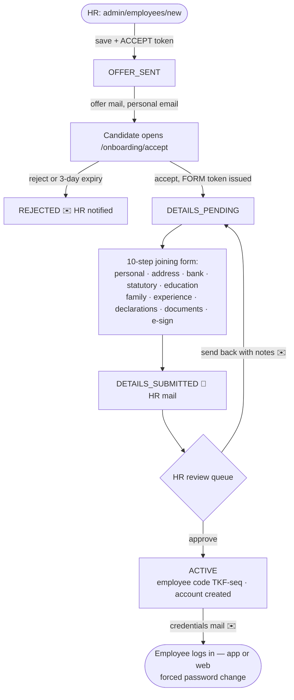
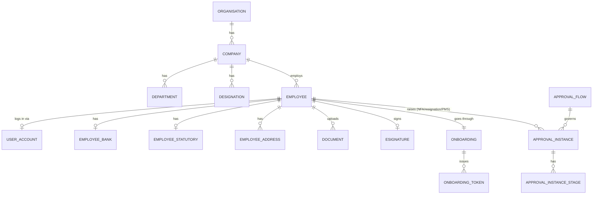
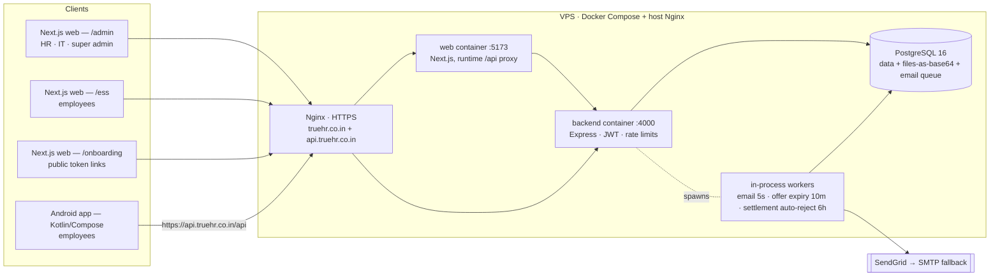

# TRUE HR — HRMS System Plan

**Version:** 2.0 (as-built)  ·  **Date:** 29 July 2026
**Scope of this document:** end-to-end description of the HRMS as actually implemented — architecture, module inventory, data model, pipelines, security and deployment. The original v1.0 plan covered only the onboarding pipeline; the system has since grown into a full HRMS (attendance, leave, payroll, tours, tasks, support desk, resignation chains, NFA/settlements, PMS/KPI, vendors) and this document reflects the shipped code.

---

## 1. Overview

TRUE HR (product name **TrueHR**, operated by L R Technology) is a single-tenant HRMS: one organisation (**TRUE HR**) with one seeded company. Three clients, one backend:

| Component | Who uses it | Tech |
|---|---|---|
| **Web admin console** (`/admin`) | HR, IT admin, super admin | Next.js 14 (App Router) + Tailwind |
| **Onboarding web flow** (`/onboarding/*`) | New hire (pre-hire, token links) | Next.js, public token-gated pages |
| **Employee Self-Service portal** (`/ess`) | Employees (browser, or via app SSO handoff) | Next.js, JWT |
| **Employee mobile app** | Active employees | Native Android — Kotlin, Jetpack Compose (Material 3), Hilt, Retrofit, Room, WorkManager |
| **Backend API** | All clients | Node.js (ESM) + **Express 4** — plain JS, no framework layer, no ORM (raw `pg`) |
| **Database** | — | PostgreSQL 16 (`pgcrypto` extension) |
| **Email** | Automated mails | SendGrid → SMTP fallback → dev-log; all async via DB-backed queue |
| **File storage** | Docs, photos, signatures, PDFs | **Postgres itself** — base64 in TEXT columns (no S3/object storage) |
| **Background jobs** | Email, offer expiry, settlement auto-reject | In-process `setInterval` workers (no Redis/BullMQ) |

> There is **no admin functionality in the Android app** — admin/HR work happens only in the web console. The app is employee-facing; heavier ESS features (NFA, PMS, vendors) open in the web portal via a one-tap SSO handoff (`POST /auth/web-sso-token` → `/sso?t=…`). A native NFA/PMS suite exists in the app but is disabled behind `FeatureFlags.NFA_SUITE = false`.

**Production:** Docker Compose on a VPS (db + backend + web, all bound to localhost), host Nginx terminating HTTPS for `truehr.co.in` (landing + `/app` → web) and `api.truehr.co.in` (API). Web app lives under the `/app` basePath.

---

## 2. Organisation structure

```
Organisation: TRUE HR
   └── Company: True HR Pvt Ltd   (static, seeded; employee-code prefix TKF)
          ├── Departments (Engineering, HR, Sales, …)
          ├── Designations (SDE-1, HR Manager, …)
          └── Employees
                 ├── reporting_manager   → Employee
                 ├── function_manager    → Employee
                 └── operational_manager → Employee
```

Roles (account level, `user_role` enum): **SUPER_ADMIN**, **HR_ADMIN**, **IT_ADMIN**, **EMPLOYEE**. Approval-chain roles (Reporting Manager, Functional Head, Finance, HR, …) are a separate concept resolved per request by the approval engine (§6), not account roles.

---

## 3. The onboarding pipeline

Modelled as a state machine on an `onboarding` record. `onboarding_state` enum (as migrated): `OFFER_SENT`, `OFFER_ACCEPTED`, `DETAILS_PENDING`, `DETAILS_SUBMITTED`, `HR_REVIEW`, `SENT_BACK`, `APPROVED`, `ACTIVE`, `EXPIRED`, `REJECTED`, `INACTIVE`.

### 3.1 States & transitions

| # | State | Triggered by | What happens | Email / notification |
|---|---|---|---|---|
| 1 | `OFFER_SENT` | HR creates employee (`POST /employees`) | Employee + onboarding rows saved; single-use **ACCEPT token** issued (default expiry `OFFER_EXPIRY_DAYS` = 3 days). Offer-letter PDF (with Annexure A salary breakup) can be attached or auto-generated from CTC. | ✉️ **Offer mail** → personal email with accept link |
| 2 | `DETAILS_PENDING` | Candidate accepts (`POST /onboarding/accept`) | ACCEPT token consumed; **FORM token** issued (7-day validity). The 10-step joining form opens. | — |
| 2b | `REJECTED` | Candidate rejects, or offer expires unused (expiry worker) | Offer declined / auto-rejected with audit entry. | ✉️ HR notified |
| 3 | `DETAILS_SUBMITTED` | Candidate submits + e-signs | Bank, statutory (PAN/Aadhaar/UAN/PF/ESI), addresses, education, family, experience, declarations/nominee, documents uploaded; canvas **e-signature** stored with IP + user-agent. Server-side PAN/Aadhaar/IFSC/phone format validation; PII encrypted before insert. | 🔔 **HR review-needed** mail |
| 4 | `SENT_BACK` | HR sends back with notes | FORM token re-issued; candidate re-opens the form with review notes shown, fixes, resubmits. | ✉️ Correction-request mail |
| 5 | `ACTIVE` | HR approves (`POST /onboarding/:id/approve`) | Sequential **employee code** generated (prefix `TKF`, starting 5001), `EMPLOYEE` user account created with temp password + `must_change_password`. | ✉️ **Credentials mail**: Employee ID + temp password + app link |
| — | `INACTIVE` | HR deactivates later | Login disabled; dropped from directory, team views and payroll runs. | — |

### 3.2 Flow diagram


```mermaid
flowchart TD
    A([HR: admin/employees/new]) -->|save + ACCEPT token| B[OFFER_SENT]
    B -->|offer mail, personal email| C[Candidate opens /onboarding/accept]
    C -->|reject or 3-day expiry| R[REJECTED ✉️ HR notified]
    C -->|accept, FORM token issued| D[DETAILS_PENDING]
    D --> E[10-step joining form:<br/>personal · address · bank · statutory · education<br/>family · experience · declarations · documents · e-sign]
    E --> F[DETAILS_SUBMITTED 🔔 HR mail]
    F --> G{HR review queue}
    G -->|send back with notes ✉️| D
    G -->|approve| H[ACTIVE<br/>employee code TKF-seq · account created]
    H -->|credentials mail ✉️| I([Employee logs in — app or web<br/>forced password change])
```

### 3.3 Secure links (magic links)

- Random 32-byte token; only its **SHA-256 hash** stored (`onboarding_tokens`).
- Single-use, purpose-bound (`ACCEPT` | `FORM`), expiring (accept 3 days, form 7 days).
- All public onboarding endpoints resolve the token server-side before acting.
- An **expiry worker** (10-min poll) auto-rejects offers whose accept token lapsed and notifies HR.

---

## 4. Module inventory (as built)

Beyond onboarding, the following modules are live in backend + web; ✅📱 marks native Android support.

| Module | What it does |
|---|---|
| **Attendance** ✅📱 | Punch in/out with GPS + selfie photo + reverse-geocoded address; daily/monthly views; team view for managers; hold/release of a report's day; regularized-days view. Punching is app-only (camera+GPS); web ESS shows calendars. |
| **Miss-punch** ✅📱 | Apply for regularization + manager review (blocks already-complete days). |
| **On-Duty (OD)** ✅📱 | One-tap OD apply (photo + location), eligibility check, manager review; approved OD earns a comp-off credit. |
| **Leave** ✅📱 | State-wise statutory entitlements (EL/CL/SL per state, 14 states seeded), HR-managed state holidays, working-day counting (skips Sundays + holidays), half-day, sick-certificate upload, cancel, overlap + one-day-gap rules, pending-aware balances. Leave types: EL/CL/SL/RH/MH/ML/MSL/LWP/WFH, configurable in `admin/leave-config`. |
| **Comp-Off** ✅📱 | Credits from approved OD (30-day expiry), avail + team review. |
| **Tours / geo-tagging** ✅📱 | Live GPS tour tracking (foreground service, offline Room buffer + WorkManager sync, idempotent `client_uuid/seq`), server-side distance with outlier filtering, route maps, geo-tagged photo stamps. |
| **Tasks** ✅📱 | Assign to reports, my/team task lists, summary counts, status updates. |
| **Support desk** ✅📱 | HR/IT/Admin ticket catalog, create with attachments, HR resolve portal. |
| **Policies & banners** ✅📱 | Fixed policy-document catalog (HR upload/replace, employee download); dashboard banner carousel managed by HR. |
| **Payroll** ✅📱 (view) | Per-employee salary structures + company default template, live breakup preview (special allowance auto-balances to CTC), compute engine with proration (DOJ/exit/LWP), draft → publish lock, bulk generate-all/publish-all with email, payslip PDFs, bank-advice CSV, register CSV/Excel export. |
| **Resignation / exit** ✅📱 | Apply runs a **6-stage approval chain** (RM → Functional Head → IT Infra → Office Admin → Finance → HR); account is **blocked system-wide on submit** (middleware-enforced, re-enabled on reject/withdraw, HR manual enable); chain visible/actionable to matrix approvers; withdraw; HR admin list/review; CSV export. |
| **NFA (Note For Approval)** | Expense/advance/purchase requests: server-computed totals, `NFA<year><seq>` codes, conditional invoice block for client-billable, 6-stage chain with preview, approver inbox, edit-with-remark, finance-only payment release, per-employee FY ledger, admin queue with filters. |
| **NFA settlements** | Submit after payment release; own 6-stage chain (RM → Functional Head → Admin → Finance → Director → Closer); reject → resubmit; **auto-reject worker** for overdue unsubmitted settlements (`SETTLEMENT_GRACE_DAYS`, default 7). |
| **NFA masters & reports** | Business operations, group companies, zones, projects, locations, unified clients/vendors, 3-level expense hierarchy (Category → Header → SubHeader) with paste-from-Excel bulk import; FY dashboard, project-wise expense, client billing, settlement register — all CSV/**xlsx** (exceljs) export. |
| **PMS / KPI** | Monthly KPI (KRA weightages sum 100, measurement bands, copy-previous), RM approve/discuss, self-assessment (weighted self-rating), 4-level PLI rating chain with matrix-manager bypass, grade ladder **OAT-5 … SBT-1**, 12-month performance strip on ESS dashboard. |
| **Vendors & agreements** | Vendor registration (statutory fields + doc slots) with admin approval — approved vendors auto-join the clients/vendors master; agreement uploads + review. |
| **Users & roles** | HR/IT/super-admin can create staff accounts, enable/disable, change roles (super-admin guards: only SUPER_ADMIN grants/edits SUPER_ADMIN, no self-edit). |
| **Audit log** | All sensitive actions recorded; searchable admin view + CSV export. |
| **Dashboard** | HR landing: headcount, onboarding pipeline, pending approvals (leave/OD/miss-punch/comp-off), open tickets, payroll published count. |

**Feature flags:** web `FEATURES.nfaSuite = true` gates the NFA/PMS/vendor admin sections and the whole `/ess` portal; Android `FeatureFlags.NFA_SUITE = false` hides the native NFA/PMS/vendor screens (users reach them via the ESS web handoff instead).

---

## 5. Data model (PostgreSQL)

Single `schema.sql` (~1090 lines) applied by a custom migration runner (`npm run migrate` — schema + `ALTER TYPE`/patch statements). No ORM; raw SQL through `query()`/`tx()` helpers. Grouped by domain:

| Domain | Tables |
|---|---|
| **Org / identity** | `organisations`, `companies` (code_prefix), `departments`, `designations`, `employees` (3 manager self-FKs, `onboarding_status`, `posting_state`, `notice_period_days`, `profile` JSONB, offer-letter blob), `user_accounts` (role, status, `must_change_password`) |
| **Onboarding** | `onboarding`, `onboarding_tokens` (sha256 hash, purpose, expiry), `esignatures` (image + IP + UA) |
| **Employee PII** | `employee_bank` (`account_number_enc`), `employee_statutory` (`pan_enc`, `aadhaar_enc`; UAN/PF/ESI plaintext), `employee_addresses`, `documents` (typed base64 blobs incl. PHOTO) |
| **Time & attendance** | `attendance` (IN/OUT, lat/lng/address/photo), `miss_punch`, `on_duty`, `attendance_hold`, `comp_off_requests` |
| **Leave** | `leave_types`, `leave_balances`, `leave_requests`, `holidays` (per state), `leave_entitlements` (per state, 14 seeded) |
| **Field ops** | `tours`, `tour_points`, `geotags`, `tasks` |
| **Content & support** | `policies`, `app_banners`, `support_tickets`, `notifications` |
| **Payroll** | `salary_structures`, `company_salary_templates`, `payslips` (DRAFT/PUBLISHED, full JSONB snapshot, unique per employee/year/month) |
| **Resignation** | `resignations` (+ `approval_instance_id`) |
| **NFA masters** | `business_operations`, `group_companies`, `cost_zones`, `projects`, `office_locations`, `clients_vendors`, `expense_categories` → `expense_headers` → `expense_subheaders` |
| **NFA** | `nfa_code_seq`, `nfas`, `nfa_lines`, `nfa_settlements`, `nfa_settlement_docs` |
| **Approval engine** | `approval_flows`, `approval_flow_stages`, `approval_instances`, `approval_instance_stages`, `approval_actions`, `approver_matrix` |
| **PMS** | `kpis`, `kpi_kras` (weightages + bands JSONB), `pms_submissions`, `pms_kra_scores`, `pms_level_ratings`, `pms_grades` (seeded OAT-5…SBT-1) |
| **Vendors** | `vendor_registrations`, `agreements` |
| **Security / system** | `audit_log`, `email_queue` (attempts, provider, `next_attempt_at`), `password_reset_otps` (RESET + LOGIN purposes) |

### 5.1 Core-entity ER (onboarding & identity slice)


```mermaid
erDiagram
    ORGANISATION ||--o{ COMPANY : has
    COMPANY ||--o{ DEPARTMENT : has
    COMPANY ||--o{ DESIGNATION : has
    COMPANY ||--o{ EMPLOYEE : employs
    EMPLOYEE ||--o| USER_ACCOUNT : "logs in via"
    EMPLOYEE ||--o| EMPLOYEE_BANK : has
    EMPLOYEE ||--o| EMPLOYEE_STATUTORY : has
    EMPLOYEE ||--o{ EMPLOYEE_ADDRESS : has
    EMPLOYEE ||--o{ DOCUMENT : uploads
    EMPLOYEE ||--o| ESIGNATURE : signs
    EMPLOYEE ||--|| ONBOARDING : "goes through"
    ONBOARDING ||--o{ ONBOARDING_TOKEN : issues
    EMPLOYEE ||--o{ APPROVAL_INSTANCE : "raises (NFA/resignation/PMS)"
    APPROVAL_FLOW ||--o{ APPROVAL_INSTANCE : governs
    APPROVAL_INSTANCE ||--o{ APPROVAL_INSTANCE_STAGE : has
```

> PII policy: Aadhaar, PAN and bank account numbers are **AES-256-GCM encrypted at rest** (`PII_ENCRYPTION_KEY`, 32-byte hex; format `iv:tag:ciphertext`) and returned **masked** to HR; the employee's own profile sees decrypted values. Never rotate `PII_ENCRYPTION_KEY` in production.

---

## 6. Generic approval engine

One engine (`approvalEngine.js`) powers all multi-stage flows:

- **Flows:** NFA (6-stage), NFA settlement (6-stage), resignation (6-stage), PMS rating (4-level).
- **Approver resolution** per stage via three resolvers: `manager_chain` (RM/FH/OM from the employee record), `named_user`, or `matrix` (`approver_matrix` — most-specific match on project/category/zone; admin UI at `admin/approvers`).
- Unresolvable **optional** stages auto-bypass; actions are **Approve / Query-Hold / Reject** with mandatory remarks; resubmit resumes at the querying stage; staff override supported; rejected stages labelled "ROLE Rejected-<name>"; full trail in `approval_actions` + audit log.
- Chain preview endpoint (`GET /approvals/preview`) lets clients show the would-be chain before submission.

---

## 7. System architecture


```mermaid
flowchart LR
    subgraph Clients
      ADM[Next.js web — /admin<br/>HR · IT · super admin]
      ESS[Next.js web — /ess<br/>employees]
      ONB[Next.js web — /onboarding<br/>public token links]
      AND[Android app — Kotlin/Compose<br/>employees]
    end

    subgraph VPS [VPS · Docker Compose + host Nginx]
      NGX[Nginx · HTTPS<br/>truehr.co.in + api.truehr.co.in]
      WEB[web container :5173<br/>Next.js, runtime /api proxy]
      API[backend container :4000<br/>Express · JWT · rate limits]
      WRK[in-process workers<br/>email 5s · offer expiry 10m · settlement auto-reject 6h]
      DB[(PostgreSQL 16<br/>data + files-as-base64 + email queue)]
    end

    MAIL[[SendGrid → SMTP fallback]]

    ADM & ESS & ONB --> NGX
    AND -->|https://api.truehr.co.in/api| NGX
    NGX --> WEB --> API
    NGX --> API
    API --> DB
    API -.spawns.- WRK
    WRK --> MAIL
    WRK --> DB
```

**Notes**
- Browser calls hit `/api/*` on the web app, which proxies at runtime to the backend (`API_ORIGIN`); the Android app calls `api.truehr.co.in` directly. DB and app ports are bound to localhost only — Nginx is the sole public entry.
- No Redis and no object store: the email queue is a Postgres table drained by an in-process worker (5s poll, batch 10, exponential backoff `(attempts+1)² min`, max 5 attempts), and all binary content is base64 in Postgres.
- App → web SSO: the app requests a 60-second handoff token, opens `${WEB_URL}/sso?t=…`, and the web session is established without re-login.

---

## 8. API surface (representative — full list in `backend/src/routes/index.js`)

### Auth & session
- `POST /auth/login` (email **or** employee code) · `POST /auth/login/verify-otp` (when `LOGIN_OTP=true`; EMPLOYEE role only)
- `POST /auth/forgot-password` → `POST /auth/reset-password` (emailed 6-digit OTP, 10-min expiry, 5-attempt cap)
- `POST /auth/change-password` · `POST /auth/web-sso-token` / `POST /auth/web-sso`
- `GET /me` · `/me/profile` · `/me/team` · `/me/directory` · `/me/photo`

### Public onboarding (token-gated)
- `GET/POST /onboarding/accept` · `POST /onboarding/reject` · `GET /onboarding/form` · `GET /onboarding/offer-letter` · `POST /onboarding/document` · `POST /onboarding/details` · `POST /onboarding/esign`

### HR / admin (JWT; `requireStaff` = HR_ADMIN + SUPER_ADMIN unless noted)
- Employees & review: `GET/POST /employees`, `GET /onboarding/queue`, `POST /onboarding/:id/{approve,send-back}`, `PATCH /admin/employees/:id[/active|/bank-statutory]`, offer-letter generate, info-sheet PDF, reset-password
- Payroll: `GET/PUT /admin/salary-template`, `GET/PUT /admin/salary-structure/:employeeId`, `POST /admin/payslips/{generate,generate-all,publish-all}`, `GET /admin/payslips/export`
- Config: `/admin/{holidays,entitlements,leave-types,policies,banners}`
- NFA suite: `/admin/nfa`, `/admin/settlements`, `/admin/nfa-dashboard`, `/admin/reports/*`, `/admin/masters/*`, `/admin/approver-matrix`
- Users & audit: `/admin/users*` (`requireAnyAdmin`), `/admin/audit` (`requireAdmin` = IT + SUPER)
- `GET /admin/stats`, `GET /admin/{support,resignations,vendors,agreements}` reviews

### Employee (JWT, role EMPLOYEE — served to both app and ESS web)
- Attendance/OD/miss-punch: `POST /attendance/punch`, `GET /attendance/{today,daily,monthly,regularized,team}`, `POST /attendance/team/{hold,release}`, `POST/GET /onduty`, `POST/GET /misspunch`, `POST /{misspunch,onduty}/:id/review`
- Leave/comp-off: `GET /leave/{types,holidays,balances}`, `POST/GET /leave`, `POST /leave/:id/{review,cancel}`, `POST/GET /compoff`
- Tours/tasks: `POST /tours/start|:id/points|:id/end`, `POST/GET /geotags`, `GET/POST /tasks`, `POST /tasks/:id/status`
- Payslips/policies/support: `GET /payslips[/:id[/pdf]]`, `GET /policies[/:id/file]`, `GET /banners`, `GET/POST /support`
- Resignation: `GET /resignation/{context,team}`, `POST /resignation[/:id/{withdraw,review,act}]`, `GET /resignation/:id/chain`
- NFA/PMS/vendors: `POST/GET /nfa`, `POST /nfa/:id/{act,resubmit,settlement,release-payment}`, `GET /nfa/{pending,ledger}`, `GET /settlements/pending`, `POST/GET /kpi`, `POST /kpi/:id/{review,pms}`, `GET /pms/pending`, `POST /pms/:id/rate`, `GET/POST /vendors`, `GET/POST /agreements`
- Health (no auth, outside `/api`): `GET /health`, `GET /health/ready`

---

## 9. Email

**Templates** (`emailTemplates.js`, shared branded HTML shell): offer, offer-rejected (→ HR), HR-review-needed, sent-back/correction, credentials, password-reset OTP, login OTP, payslip-published, approval-pending, approval-action.

**Delivery:** every send is enqueued to `email_queue` — never inline. The worker polls every 5s (batch 10), tries **SendGrid → SMTP → dev-log**, records provider + message id, retries up to 5 times with exponential backoff, then marks `FAILED`. The queue doubles as the send audit trail.

---

## 10. Security posture

- **Auth:** JWT HS256, 7-day expiry; bcrypt (cost 10); `authenticate` middleware re-checks account status against DB (30s cache) so disabling an account kills live tokens within seconds.
- **Optional 2-step login** (`LOGIN_OTP` env): 6-digit emailed OTP after password, EMPLOYEE role only; staff sign in with password alone.
- **Rate limiting:** 20 req/15 min on login/SSO/password-reset endpoints; 1500 req/5 min globally on `/api`. `helmet` headers, CORS allowlist, `trust proxy`.
- **PII:** AES-256-GCM at rest for bank account / PAN / Aadhaar, masked in HR views; production boot refuses default/missing `JWT_SECRET`, `PII_ENCRYPTION_KEY`, `DATABASE_URL`.
- **Magic links:** hashed, single-use, purpose-bound, expiring (§3.3).
- **Resignation lockout:** submitting a resignation disables the account system-wide immediately (middleware-enforced); re-enabled on reject/withdraw or manually by HR.
- **Audit:** logins, onboarding transitions, employee/user/role changes, approvals, payroll runs, auto-rejections all land in `audit_log`; unique index on `lower(official_email)`.
- Account-enumeration-safe password reset (always returns ok); 401 auto-logout on web and app.

---

## 11. Deployment

- **Prod:** `docker compose -f docker-compose.prod.yml --env-file .env.production up -d --build` — Postgres (network-internal only), backend on `127.0.0.1:4000`, web on `127.0.0.1:5173`; host Nginx serves the landing page at `/`, proxies `/app` → web and `/api` → backend on `truehr.co.in`, plus `api.truehr.co.in` for the app. Migrations run automatically on boot.
- **Android:** two flavors — `prod` (`https://api.truehr.co.in/api/`) and `staging` (`10.0.2.2:4000` emulator); minSdk 24 / target 34; R8 minified release; `MAPS_API_KEY` from `local.properties`.
- **Never:** `docker compose down -v` (destroys the DB volume — which also holds all documents), rotate `PII_ENCRYPTION_KEY`, or commit `.env.production`.
- **Testing:** backend flow suites in `backend/scripts/` (approval engine, masters, NFA, settlement, reports, resignation chain, vendors, payroll run, PMS, OTP flows, user roles — 100+ checks against a fresh Postgres). No web/Android automated tests; Android verified by clean Rebuild in Android Studio.

---

## 12. Delivery status & build history

The v1.0 phases (foundation → HR create/offer → employee onboarding → review/activation → Android app → hardening) are **all delivered**, plus these major additions beyond the original plan:

1. Attendance/leave/comp-off/OD/miss-punch suite with state-wise statutory entitlements.
2. Tour management with live GPS tracking, offline sync and geo-tagged photos.
3. Full payroll (structures, templates, proration, bulk runs, PDFs, bank advice).
4. Generic approval engine + NFA / settlements / masters / reports (GreenHR parity build, Jun–Jul 2026).
5. PMS/KPI with grade ladder and PLI rating chains.
6. Resignation approval chains with system-wide account lockout.
7. Vendor registration & agreements.
8. Two-step login OTP, forgot-password OTP, app→web SSO, design-system upgrade.

---

## 13. Known gaps & technical debt

1. **Files live in Postgres as base64** (photos, documents, PDFs, banners). Fine at current scale; plan a move to object storage (S3-compatible) if document volume grows — the DB volume is currently the single store of everything.
2. **UAN / PF / ESI numbers stored plaintext** — only PAN, Aadhaar and bank account are encrypted. Decide whether these need the same treatment.
3. **Hard-coded HR notification address** (`hr@truehr.example`) in the onboarding reject/e-sign notification paths — should come from config or the HR user list.
4. **No push notifications**: the app's dashboard bell is a no-op; `notifications` table exists but there's no FCM integration or notifications API/screen.
5. **Change Password does not verify the current password** (deliberate per client request — documented security trade-off).
6. **Legacy Vite SPA remains in `web/src/`** (dead code, not built) — safe to delete along with `vite.config.js` / `index.html`.
7. **Android native NFA/PMS suite** is complete but flag-disabled (`NFA_SUITE=false`) pending compile verification in Android Studio; ESS web handoff covers those features meanwhile.
8. Placeholder content pending from client: HR induction videos / feedback / COC / asset / tax screens; real expense-hierarchy Excel, entity/project/zone lists, approver matrix rows; PLI → payroll linkage; contact email in legal docs.
9. Optional/not built: leave auto-approve, year-end carry-forward, manager/HR web view of team tours, in-process workers → real queue if multi-instance scaling is ever needed (workers assume a single backend container).
10. `MAPS_API_KEY` must be present in `android/local.properties` or Google Maps render blank (distance/route data still works).
